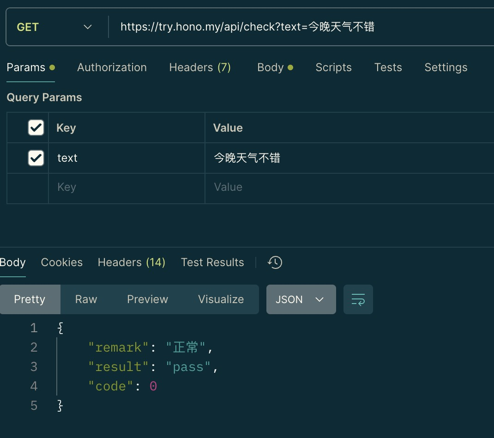
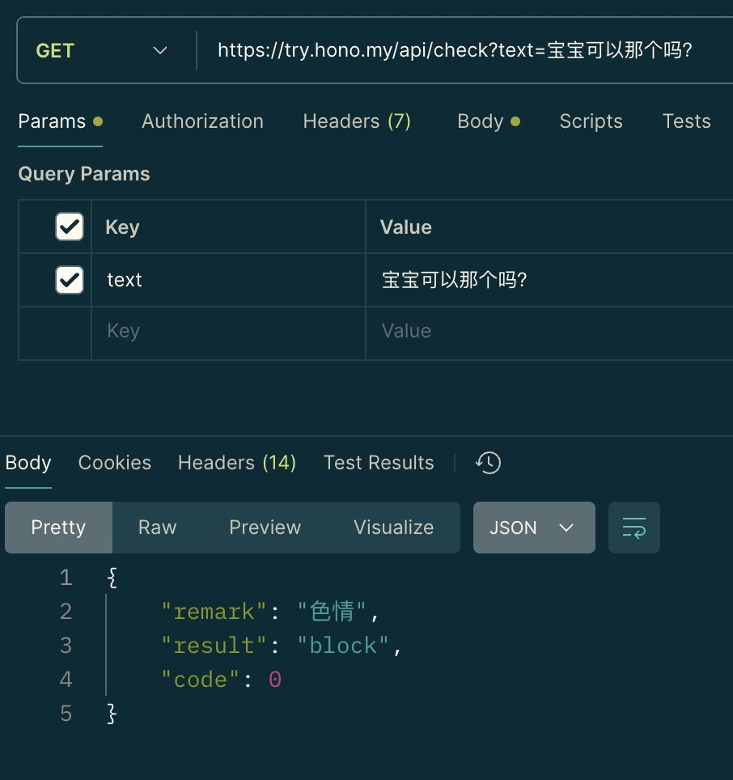

# 文本审核 API 服务

基于 **Hono** 和 **OpenAI** 的文本审核 API 服务，使用了 **千问大模型**，能够高效、准确地对文本内容进行审核和分类。此服务支持识别色情、暴力、涉政等敏感内容，并可根据上下文进行语境判断，适合需要高精度文本审核的场景。

## 功能特性

- **语境分析**：支持上下文理解，提高分类准确性。
- **色情内容识别**：准确识别潜在的色情内容。
- **暴力内容识别**：检测文字中的暴力倾向和表达。
- **涉政内容识别**：过滤敏感政治内容。
- **多领域扩展性**：可以根据需求调整模型参数和审核策略。

## 技术栈

- **Hono**：用于构建高性能的 API 后端框架。
- **OpenAI**：提供 Qwen 大模型的文本处理能力。
- **Qwen-2-7b**：负责具体的文本审核任务，包括敏感内容识别和语境判断。

## 效果图





## 快速开始

### 环境要求

- Node.js 版本：`16.x` 或以上
- npm / yarn
- OpenAI API 密钥

### 安装依赖

在项目根目录下执行以下命令：

```bash
pnpm install
```

### 配置文件

在项目根目录创建 `wrangler.toml` 文件，设置 [OpenRouter](https://openrouter.ai/settings/keys) API 密钥：

```bash
cp wrangler.toml.example wrangler.toml 
```

可以修改以下配置：

- `OPENAI_BASE_URL`：API 服务的基础 URL。
- `OPENAI_API_KEY`：OpenAI API 密钥。
- `OPENAI_MODEL`：OpenAI 模型名称。

### 启动服务

运行以下命令启动 API 服务：

```bash
pnpm run dev
```

启动后，API 服务将运行在 http://localhost:8787 上。

可以使用 CURL 命令进行验证：

```bash
curl -X POST http://localhost:8787/api/check -d 'text=今晚可以那个吗？' 
```

### 发布到 Cloudflare Workers

```bash
pnpm run deploy
```

## 贡献

欢迎提交 Issue 和 Pull Request 来改进此项目。如有任何问题，请在仓库中进行讨论。

### License

MIT

